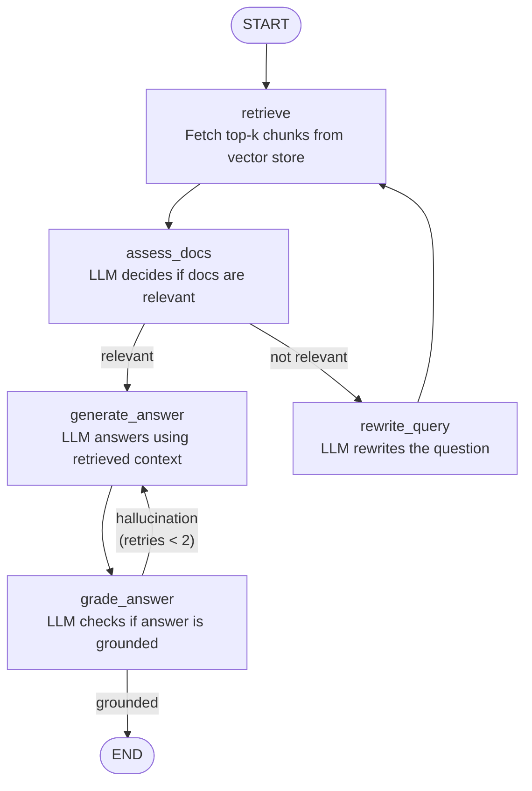

# Simple LangGraph RAG

[](https://colab.research.google.com/github/kumarsirish/FDP-AGENENTIC-AI-RAG/blob/main/rag-langgraph-02/fictional-depatment-rag-langraph.ipynb)

A **Corrective RAG** pipeline built with LangGraph. The graph retrieves documents, assesses their relevance, optionally rewrites the query, generates an answer, and checks whether the answer is grounded in the retrieved context.

## Graph



## Nodes

| Node | Role |
|---|---|
| **retrieve** | Fetch top-k chunks from the FAISS vector store |
| **assess_docs** | LLM decides if retrieved docs are relevant to the question |
| **rewrite_query** | LLM rewrites the question when docs are not relevant |
| **generate_answer** | LLM answers using the retrieved context |
| **grade_answer** | LLM checks whether the answer is grounded in the docs |

## Routing

- After `assess_docs` → `generate_answer` if relevant, else `rewrite_query → retrieve`
- After `grade_answer` → `END` if grounded, else retry `generate_answer` (max 2 attempts)

## Running the Notebook

### Option A — Google Colab

Add the following secrets in the Colab **Secrets** panel (🔑):

| Secret | Description |
|---|---|
| `GEMINI_API_KEY` | Google Gemini API key (default model) |
| `HF_TOKEN` | HuggingFace token (for embedding model) |

### Option B — Local

1. **Install dependencies**
   ```bash
   pip install -r requirements.txt
   ```

2. **Set environment variables** in `~/FDP-AGENENTIC-AI-RAG/.env`:
   ```
   GEMINI_API_KEY=your-gemini-key
   HF_TOKEN=your-hf-token
   ```

3. **Open the notebook**
   ```bash
   jupyter notebook fictional-depatment-rag-langraph.ipynb
   ```

## Supported LLM Providers

Switch providers by changing `MODEL_NAME` in cell 5:

| Provider | `MODEL_NAME` value |
|---|---|
| Google Gemini *(default)* | `google_genai:gemini-2.5-flash` |
| HuggingFace | `huggingface:TinyLlama/TinyLlama-1.1B-Chat-v1.0` |
| OpenAI | `openai:gpt-4o` |
| Anthropic | `anthropic:claude-sonnet-4-6` |
| Ollama (local) | `ollama:llama3` |
